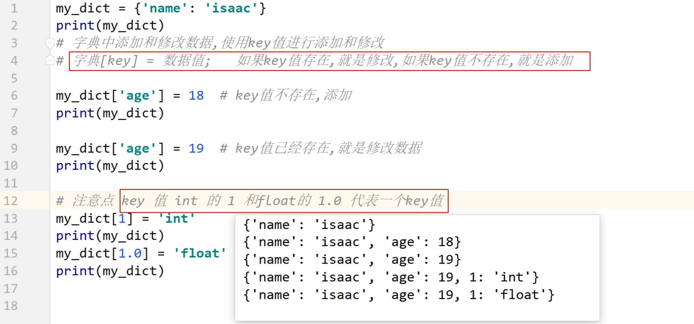
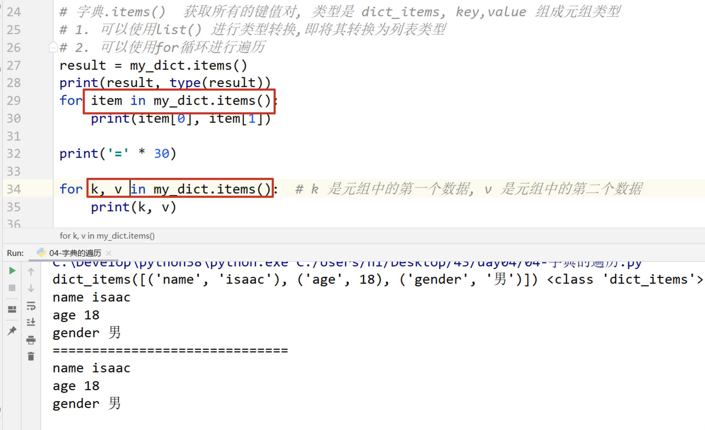
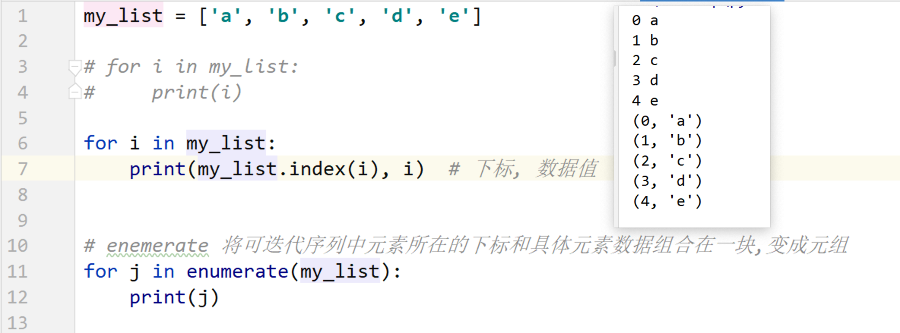
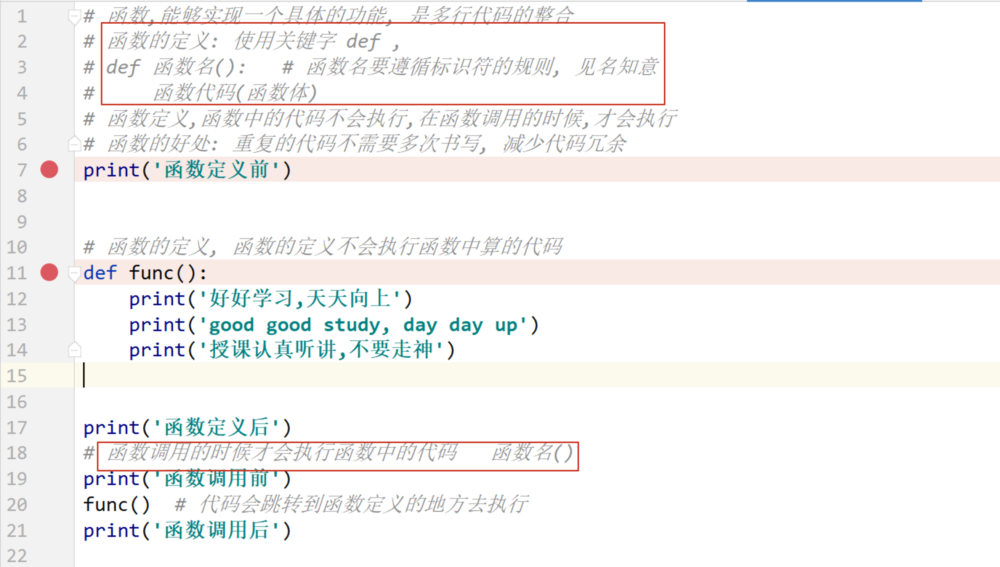
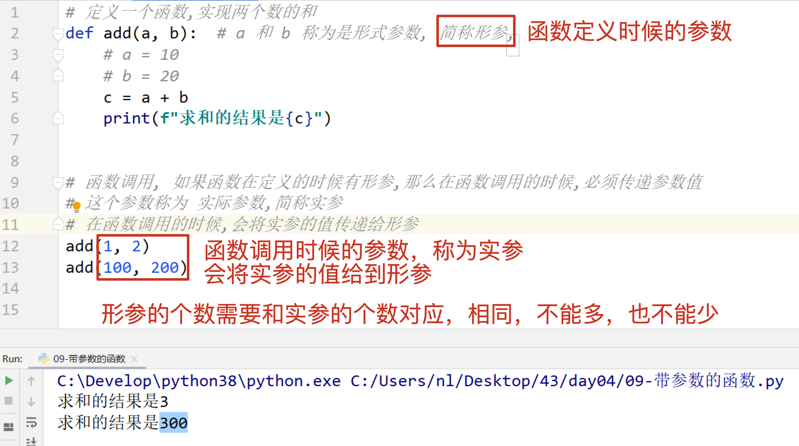
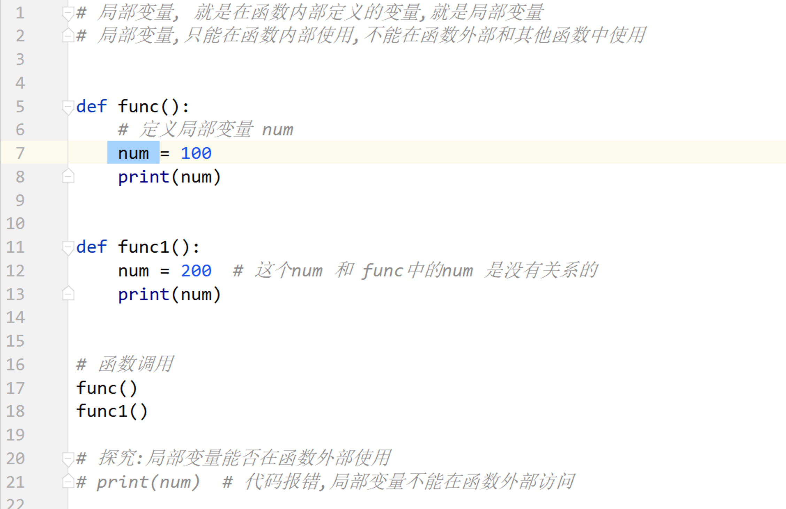
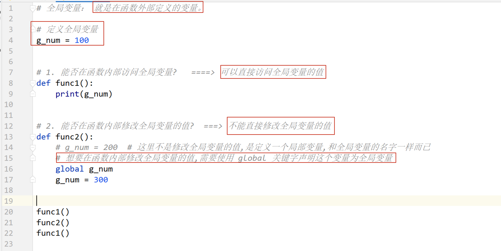
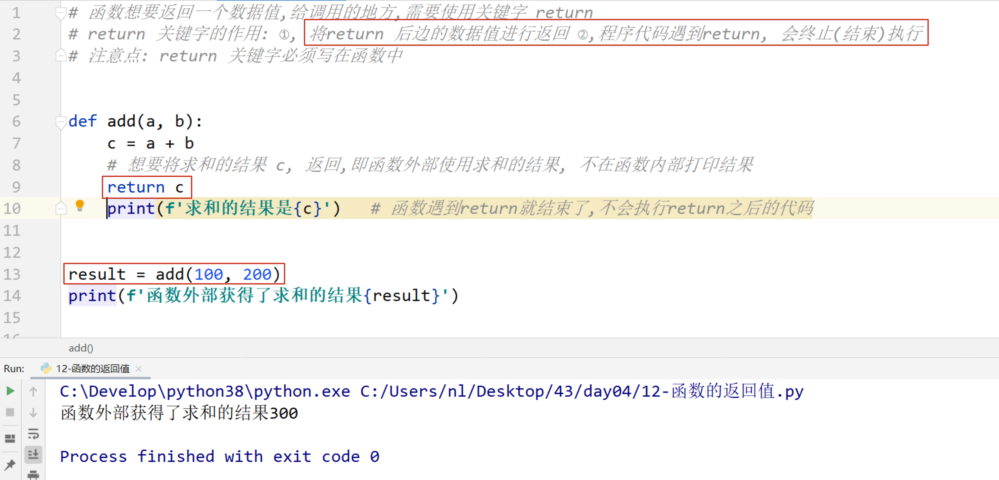

## Day04 课堂笔记

## 0. 复习反馈


## 2. 字典

### 2.1 字典的定义和访问


### 2.2 字典中添加和修改数据



### 2.3 字典中删除数据


### 2.4 字典中遍历数据

#### 1. for 循环直接遍历字典, 遍历的是字典的 key 值


#### 2. 字典.keys() 


#### 3. 字典.values()


#### 4. 字典.items()



### 2.5 enumerate 函数



### 2.6 公共方法

- `+`  支持 字符串、列表、元组进行操作， 得到一个新的容器
- `* 整数` 复制， 支持 字符串、列表、元组进行操作， 得到一个新的容器
- `in/not in`  判断存在或者是不存在，支持 字符串、列表、元组、字典进行操作， 注意： ==如果是字典的话，判断的是 key 值是否存在或不存在==

- `max/min` 对于字典来说，比较的字典的 key值的大小

  

  


### 总结答疑

```python 
1. 在字典中可以包含列表，列表中能包含字典吗？
可以的， 列表 元组可以存放任意类型的数据，同样，字典中的 valu也可以是任意的类型，字典也可以作为字典的 value 值。
```


## 函数

```python
print()  打印输出
input()  输入
len()    求容器长度的
...
函数可以实现一个具体的功能
```

### 函数的定义和调用



### 函数的文档说明


### 书写带参数的函数

> 好处： 可以使函数代码更加通用，适用更多的场景




### 局部变量

```python
局部变量的作用域（作用范围）： 当前函数的内部
局部变量的生存周期：在函数调用的时候被创建，函数调用结束之后，被销毁（删除）

局部变量只能在当前函数的内部使用，不能在函数的外部使用。
```




### 全局变量

```python 
全局变量： 就是在函数外部定义的变量。
在函数内部可以访问全局变量的值，如果想要修改全局变量的值，需要使用 global 关键字声明
```




### 返回值

```python
在函数中定义的局部变量，或者通过计算得出的局部变量， 想要在函数外部访问和使用，此时就可以使用 return 关键字，将这个返回值返回
```




### return 返回多个数据值

```python
1. 程序代码遇到一个 return 之后，后续的代码不再执行
```


```python 
1. return 关键字后边可以不写数据值， 默认返回 None
def func():
    xxx
    return   # 返回 None，终止函数的运行的

2. 函数可以不写 return，返回值默认是 None

def func():
    xxx
    pass

```


### 函数的嵌套调用


