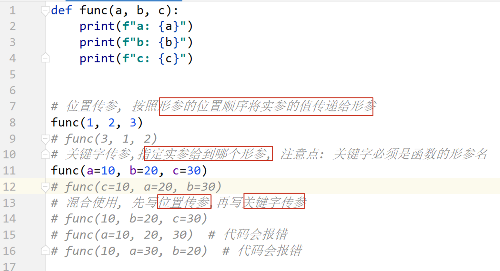
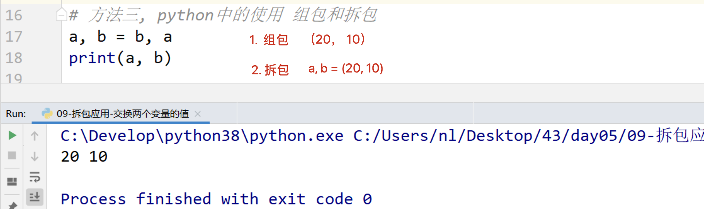
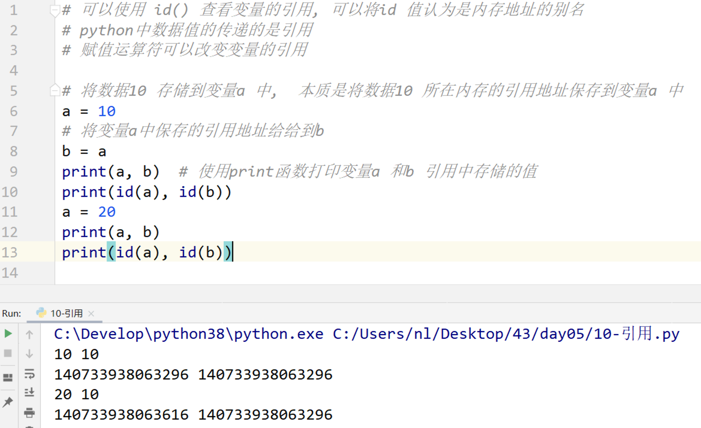
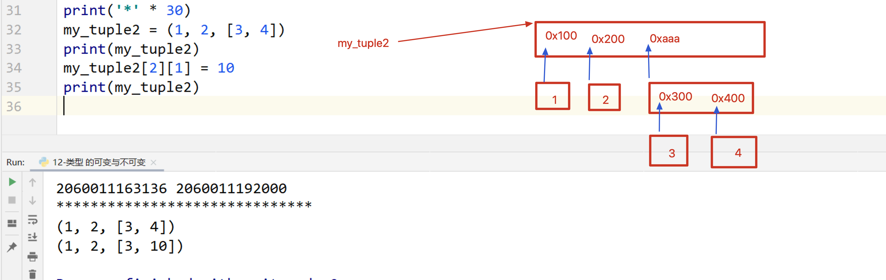
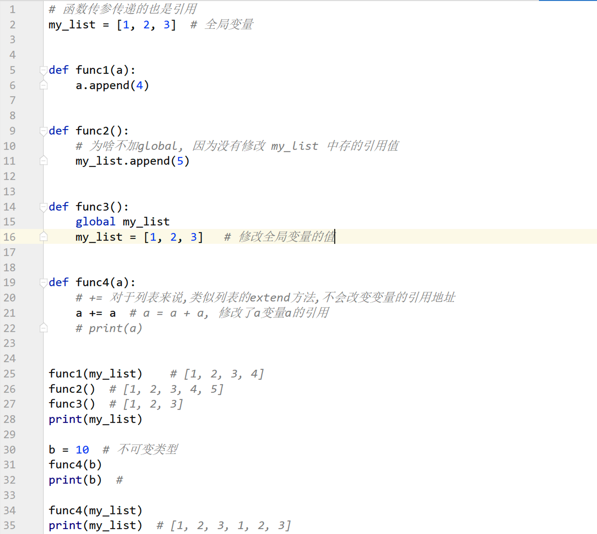
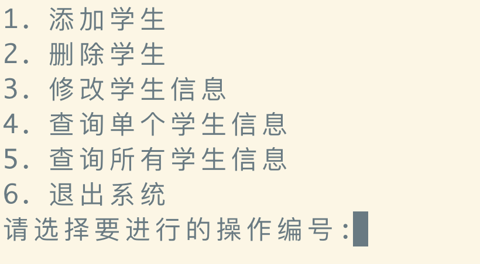

## day05 课堂笔记

## 0. 复习


```python
标识符规则: 由字母,数字和下划线组成,不能以数字开头
变量名不能和关键字重名.
关键字是系统定义好的标识符,具有特殊的作用.
数据类型: int(整型) float(浮点型) str(字符串类型) bool(布尔类型, True False) list(列表) tuple(元组)  dict(字典)
    type() 函数可以查看变量的数据类型
输入: input()  --> str  类型转换 
输出: print()  %s--字符串  %d -- int  %f--float    %--%%
    f-string {变量}

逻辑运算符
	and  逻辑与 一假为假
	or   逻辑或 一真为真
	not  逻辑非 取反
比较运算符
	==  != 

判断 if elif  else 
循环 while
	for xx in 容器/range():
        pass
    range(a, b, step)  [a, b) 之间的整数
	break 终止循环
    continue 跳过本次循环,继续下次循环
    循环 else 结构: 循环不是被 break 终止的时候会执行 else 中的代码
                        
str: 下标 切片 
list: insert append extend ...                         
tuple: 元组中的数据不能修改 查询的方法  index()
dict: key:value 键值对的形式   

函数:
定义: 使用 def  关键字, 
def 函数名(形参列表):
    函数代码
    return 数据                    
    pass                    

函数调用,才会执行函数中的代码
函数名(实参列表) 
局部变量: 在函数内部定义的变量,只能在当前函数内部使用, 如果想要将这个变量在函数外部使用, ①可以 return 将这个变量返回  ② 使用 global,将其变为全局变量
全局变量: 在任意地方可以访问,想要在函数内部修改全局变量的值,使用 global 声明                        
```

## 1.函数传参的两种形式[掌握]




## 2. 函数形参

### 2.1 缺省参数(默认参数)


### 2.2 不定长参数

```python
注意点: 函数定义中的 args 和 kwargs可以是任意的形参变量,不过习惯使用 args 和 kwargs.
```


### 2.3 函数形参的完整格式


## 3. 拆包[掌握]

- 注意点: 容器中元素数据的个数需要和变量的个数保持一致.




## 4. 引用[理解]




---


## 5. 可变与不可变类型


 

## 6. 引用做函数参数注意点



## 7. 函数应用: 学生管理系统

```python
增删改查操作
存储学生信息: 
    姓名
    年龄
    班级
    性别
    ...
    {'name': 'isaac', 'age': 18, ...}

存储所有的学生信息:
    列表: [{}, {}, {}, ....]

功能菜单,业务框架.
```




### 搭建业务框架

```python
def show_menu():
    print('1. 添加学生')
    print('2. 删除学生')
    print('3. 修改学生信息')
    print('4. 查询单个学生信息')
    print('5. 查询所有的学生信息')
    print('6. 退出系统')


while True:
    show_menu()
    opt = input('请输入用来选择的操作编号:')
    if opt == '1':
        print('1. 添加学生')
    elif opt == '2':
        print('2. 删除学生')
    elif opt == '3':
        print('3. 修改学生信息')
    elif opt == '4':
        print('4. 查询单个学生信息')
    elif opt == '5':
        print('5. 查询所有的学生信息')
    elif opt == '6':
        print('欢迎下次使用本系统......')
        break
    else:
        print('输入有误,请再次输入')
        continue

    input('...... 回车键继续操作.......')

```


### 添加学生信息

```python 
1. 通过 input 函数获取学生的信息, 姓名, 年龄, 性别
2. 将学生信息转换为字典进行保存
3. 将这个学生字典添加的列表中
代码优化:
    假设学生的名字都不能重复,在添加学生的时候,进行判断,如果学生名字已经存在,则不添加.
```


### 删除 /修改/查询学生信息

```python
都使用 name 对学生进行判断

1. 使用 input 获取要删除 /修改/查询 的学生姓名
2. 判断学生信息是否存在
3. 学生存在,对学生进行 删除 /修改/查询 操作
4. 学生信息不存在,直接结束
```


