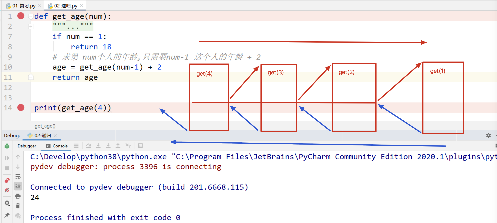
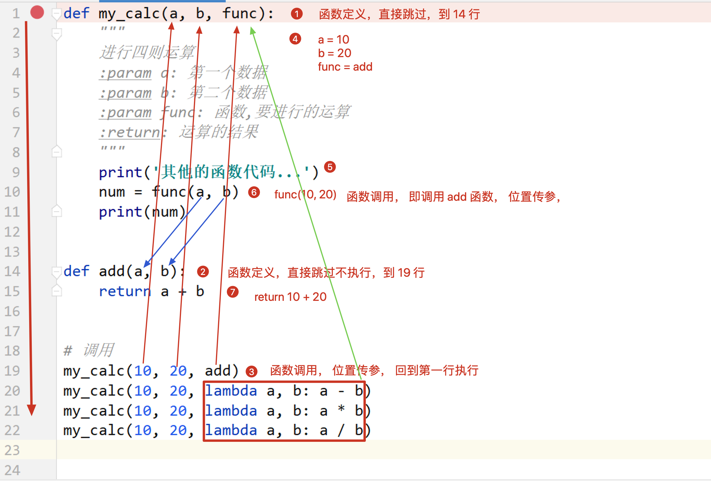
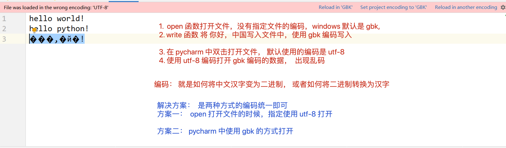

## Day06 课堂笔记

## 复习


## 递归函数[理解]

递归: 函数自己嵌套调用自己.

>已知：A 比 B 大 2 岁，B比 C 大 2 岁，... , F 年龄为 18 岁，
>
>求 A 的年龄。
>
>知道第一个人的年龄是 18 岁
>
>后边每个人比前边那个人大 2 岁
>
>后边一个人的年龄 = 前边那个人的年龄 + 2
>
>num  = (num -1) + 2

| A（6） | B（5） | C（4） | D（3） | E（2） | F（1） |
| ------ | ------ | ------ | ------ | ------ | ------ |
| 28     | 26     | 24     | 22     | 20     | 18     |

==递归函数的形成条件:==

1. ==函数自己调用自己==
2. ==函数必须有一个终止条件==




## 匿名函数

使用 `lambda` 关键字定义的函数就是匿名函数

```python
lambda 参数列表：表达式
```

1. 无参数无返回值

   ```python
   def 函数名()：
     函数代码
   
   lambda:函数代码
   ```

2. 无参数有返回值

   ```python
   def 函数名()：
   	return 1 + 2
   
   lambda: 1 + 2
   ```
   
3. 有参数无返回值

   ```python
   def 函数名(a, b):
     print(a, b)
     
     
   lambda a, b: print(a, b)
   ```

   

4. 有参数有返回值

   ```python
   def 函数名(a, b):
     return a + b
   
   
   lambda a, b: a + b
   ```


###  匿名函数的应用场景 -- 作为函数的参数使用




### lambda 函数作为函数参数(列表中字典排序)(扩展)

```python
list1 = [{'name': 'd', 'age': 19}, {'name': 'b', 'age': 16}, {'name': 'a', 'age': 16}, {'name': 'c', 'age': 20}]

```


## 列表推导式


## 集合-set


## 文件操作

文件的作用: 可以永久的保存数据.

文件在硬盘中存储的格式是二进制. 

1. 打开文件
2. 读写文件
3. 关闭文件

### 读文件-r


### 写文件-w



   

### 追加文件-a

