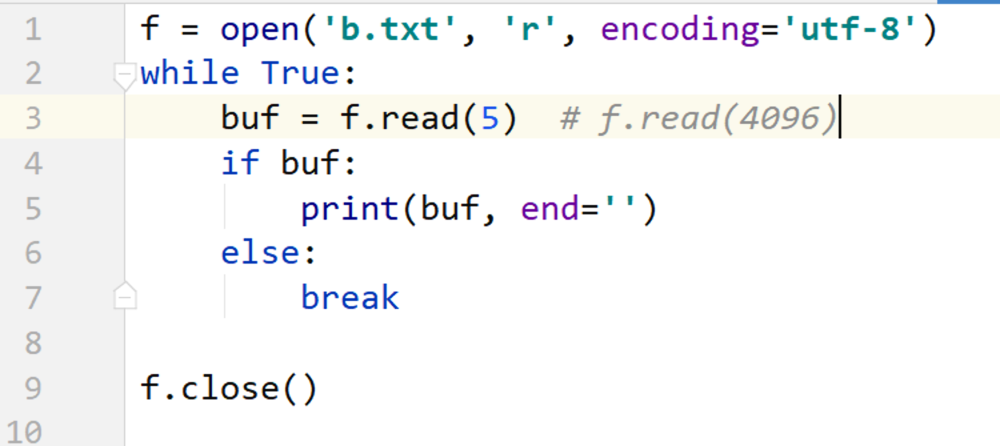
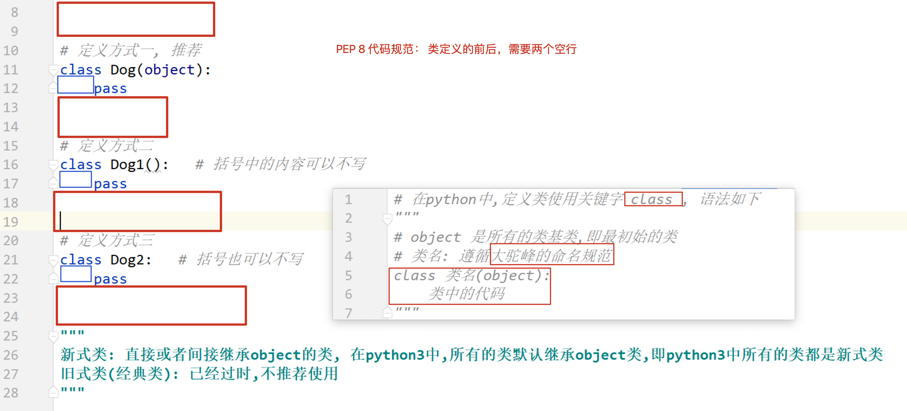

## Day07 课堂笔记

## 复习


```python
递归函数一般都是有参数.
num = 10
def func():
    global
    if num == 1:
        return 
    num = num -1
    func()
       
    
my_list = [20, 30] 
print(my_list)

def func(a):
    a += 20,  # 列表, += , extend 即 a.extend(20,)  # str list tuple dict 
    
func(my_list)
print(my_list)  # [20, 30, 20]

可迭代: 能使用 for 循环的就是可迭代的
```

## 1. 文件读操作

### read()


### 按行读取


## 模拟读取大文件

```python 
read()  一次读取全部的内容
read() 读到文件末尾会返回空
```




### 补充: 计算机中的大小

```python 
计算机只认识 0 和 1 , 
进制: 
    二进制, 只有 0 和 1 组成,逢二进一
    十进制, 0 1 2 3 4 5 6 7 8 9 , 逢十进一
    十六进制, 0 1 2 3 4 5 6 7 8 9 A B C D E F 逢十六进一
计算机最小的单位是 bit(位), 只有两个数据值 0 和 1 
字节: 是计算机中基本的储存单位 byte 
    1 byte = 8 bit
1KB = 1024 byte
1MB = 1024 KB
1GB = 1024 MB
1TB = 1024 GB
...

100Mbits  200Mbits
12.5MB/s  25MB/s
```


## 文件打开模式

```python
文本文件: txt, .py .md  能够使用记事本打开的文件
二进制文件: 具有特殊格式的文件, mp3 mp4 rmvb avi png jpg 等
    
文本文件可以使用 文本方式打开文件,也可以使用二进制的方式打开文件

二进制文件,只能使用二进制的方式打开文件
二进制打开方式如下: 不管读取,还是书写,都需要使用二进制的数据
rb wb  ab
注意点: 不能指定 encoding 参数
```


| 访问模式 | 说明                                                         |
| :------- | :----------------------------------------------------------- |
| r        | 以只读方式打开文件。文件的指针将会放在文件的开头。这是默认模式。 |
| w        | 打开一个文件只用于写入。如果该文件已存在则将其覆盖。如果该文件不存在，创建新文件。 |
| a        | 打开一个文件用于追加。如果该文件已存在，文件指针将会放在文件的结尾。也就是说，新的内容将会被写入到已有内容之后。如果该文件不存在，创建新文件进行写入。 |
| rb       | 以二进制格式打开一个文件用于只读。文件指针将会放在文件的开头。这是默认模式。 |
| wb       | 以二进制格式打开一个文件只用于写入。如果该文件已存在则将其覆盖。如果该文件不存在，创建新文件。 |
| ab       | 以二进制格式打开一个文件用于追加。如果该文件已存在，文件指针将会放在文件的结尾。也就是说，新的内容将会被写入到已有内容之后。如果该文件不存在，创建新文件进行写入。 |
| r+       | 打开一个文件用于读写。文件指针将会放在文件的开头。           |
| w+       | 打开一个文件用于读写。如果该文件已存在则将其覆盖。如果该文件不存在，创建新文件。 |
| a+       | 打开一个文件用于读写。如果该文件已存在，文件指针将会放在文件的结尾。文件打开时会是追加模式。如果该文件不存在，创建新文件用于读写。 |
| rb+      | 以二进制格式打开一个文件用于读写。文件指针将会放在文件的开头。 |
| wb+      | 以二进制格式打开一个文件用于读写。如果该文件已存在则将其覆盖。如果该文件不存在，创建新文件。 |
| ab+      | 以二进制格式打开一个文件用于追加。如果该文件已存在，文件指针将会放在文件的结尾。如果该文件不存在，创建新文件用于读写。 |

## 应用-文件备份

```python
1. 用只读的方式,打开文件
2. 读取文件内容
3. 关闭文件
4. 只写的方式,打开新文件
5. 将 第 2 步读取的内容写入新文件
6. 关闭新文件

思考:
    1. 如果文件比较大,循环读取文件
    2. 复制备份的文件可能是 txt 文件,可能是 二进制文件,  ---> 使用二进制方式打开文件
```


## 文件和文件夹的操作


## 应用-批量修改文件名


## 学生管理系统文件版

```python
学生管理系统
{'name': 'isaac', 'age': 18, 'gender': m}

[{}, {}]
需要将所有的学生信息保存的到文件中.最简单的的方法,是将整个列表保存到文件中
'[{}, {}, {}]'   
w

'[{}, {}, {}]'   ---> [{}, {}, {}]
eval()
```


```python
'[{}, {}, {}]'   ---> eval('[{}, {}, {}]')
stu_list 
```


## 面向对象

### 概念介绍[了解]

==面向对象和面向过程,是两种编程思想.== 编程思想是指对待同一个问题,解决问题的套路方式.

- 面向过程: 注重的过程,实现的细节.亲力亲为.
  - 函数

- 面向对象: 关注的是结果,  偷懒.
  - 封装, 继承 和多态(三大技术)


### 类和对象[理解]

类和对象,是面向对象中非常重要的两个概念

- 类
  - 类是泛指的,指代多个, 是由对的抽象来的
  - 在代码中, 是通过关键字`class`定义的
- 对象
  - 对象是特指的,指代一个,是具体存在的
  - 在代码中, 对象是由类创建的

### 类的组成

- 类名
- 属性: 特性, 变量
  - 一个类的属性有很多,值关注需要使用的,没有用到的不用管
- 方法: 行为, 函数

### 类的抽象

- 名词提炼法
- 所见即所得

### 类的定义

```python
随后的代码,使用狗类进行演示说明
类名: Dog(狗类)
属性:
    姓名 name
    年龄 age
    ....
方法:
    吃  eat()
    玩  play()
    .....
```



### 创建对象

在代码中,对象是由类创建的.

