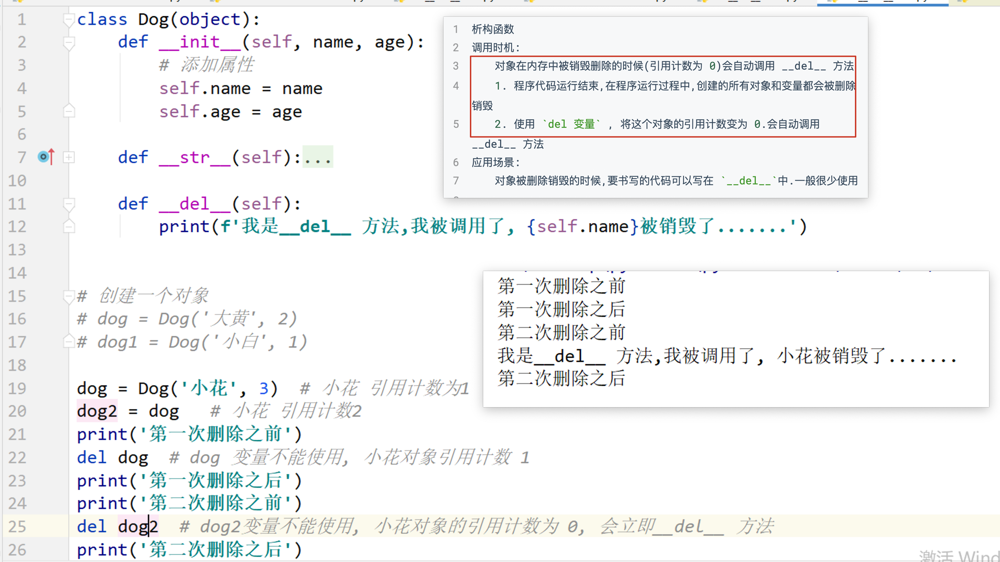
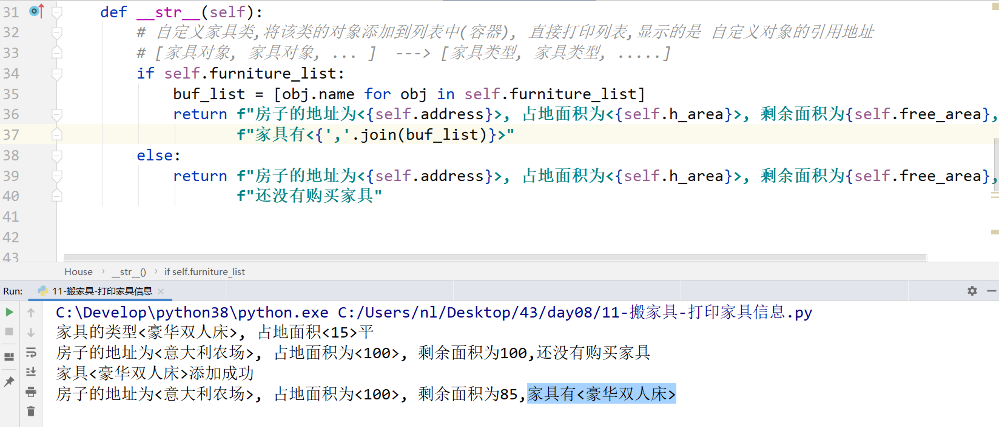

## Day08 课堂笔记

## 0. 复习和反馈


```python
单选 多选
代码题

while True: pass  使用场景,在书写代码的时候,不确定循环一共执行多少次,即不知道循环在什么时候结束, 具体结束的时间,在运行代码的过程中才能确定,在代码中进行 if 判断,如果条件不满足,就使用 break,终止循环

my_list = list()  # 创建列表类对象
my_dict = dict()  # 创建字典类对象
my_tuple = tuple()  # 创建元组类对象
-------
class 类名(object):
    def 函数名(self):
        pass
```


## 1. 类外部添加和获取对象属性


## 2. 类内部操作属性


## 3. 魔法方法

```bash
在 python 的类中,有一类方法,这类方法以 `两个下划线开头` 和`两个下划线结尾`, 并且在`满足某个特定条件的情况下,会自动调用`. 这类方法,称为魔法方法

如何学习魔法方法:
1. 魔法方法在什么情况下会自动调用
2. 这个魔法方法有什么作用
3. 这个魔法方法有哪些注意事项
```

### `__init__()` [掌握]

```bash
调用时机: 在创建对象之后,会立即调用.
作用: 
	1. 用来给对象添加属性,给对象属性一个初始值(构造函数)
	2. 代码的业务需求,每创建一个对象,都需要执行的代码可以写在 `__init__ `中
注意点: 如果 `__init__` 方法中,有出了 self 之外的形参,那么在创建的对象的时候,需要给额外的形参传递实参值 `类名(实参)`
```


### `__str__()`[掌握]

```bash
调用时机:
	1. `print(对象)`, 会自动调用 `__str__` 方法, 打印输出的结果是 `__str__` 方法的返回值
	2. `str(对象)`  类型转换,将自定义对象转换为字符串的时候, 会自动调用
应用:
	1. 打印对象的时候,输出一些属性信息
	2. 需要将对象转换为字符串类型的时候
注意点:
	`方法必须返回一个字符串`,只有 self 一个参数
```


### `__del__()`[理解]

```bash
析构函数
调用时机:
	对象在内存中被销毁删除的时候(引用计数为 0)会自动调用 __del__ 方法
	1. 程序代码运行结束,在程序运行过程中,创建的所有对象和变量都会被删除销毁
	2. 使用 `del 变量` , 将这个对象的引用计数变为 0.会自动调用 __del__ 方法
应用场景:
	对象被删除销毁的时候,要书写的代码可以写在 `__del__`中.一般很少使用

引用计数: 是 python 内存管理的一种机制, 是指一块内存,有多少个变量在引用,
1. 当一个变量,引用一块内存的时候,引用计数加 1
2. 当删除一个变量,或者这个变量不再引用这块内存.引用计数减 1
3. 当内存的引用计数变为 0 的时候,这块内存被删除,内存中的数据被销毁

my_list = [1, 2]  # 1
my_list1 = my_list # 2
del my_list  # 1
del my_list1 # 0 

```



## 案例: 烤地瓜

```bash
封装的小套路:
1. 根据文字的描述信息,确定对象,对象有什么,就是属性
2. 根据文字的描述信息, 对象能干什么,就是方法
3. 根据文字的描述信息, 确定方法怎么书写
```

```python
类名: 地瓜类 Potato
属性:
    状态 status='生的'
    烧烤总时间 total_time = 0
方法:
    def cook(self, 烧烤时间):
        计算烧烤的总时间
        修改地瓜的状态的
        pass
    输出信息  __str__()
    定义属性  __init__() 
```


### 烤地瓜-调料版

```python
属性:
    调料: name_list = []
方法:
    添加调料 add()
```


## 案例: 搬家具

```python
类名: 家具类 Furniture 
属性:
    类型 name 
    面积 area
方法:
    输出家具信息  __str__ 
    定义属性  __init__ 
--------
类名: 房子类 House
属性:
    地址 address
    面积 h_area
    家具列表  furniture_list = []
方法:
    添加家具  add_furniture()
    输出房子信息 __str__ 
    定义属性  __init__ 

```





