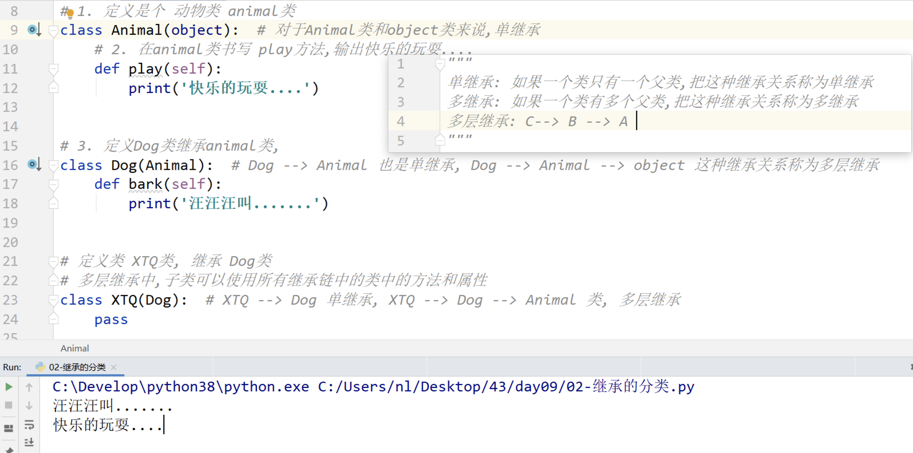
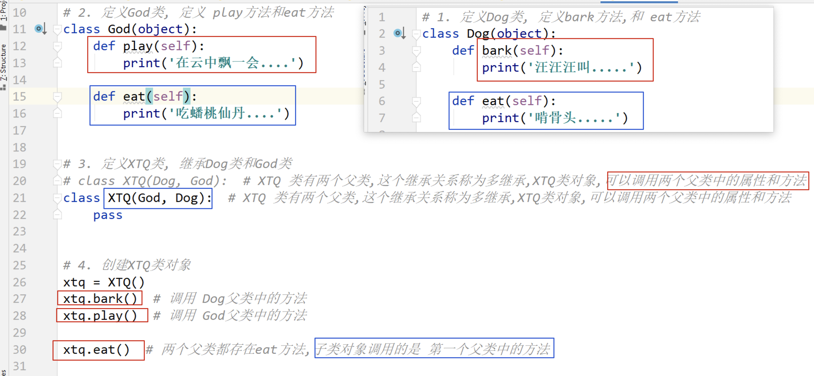
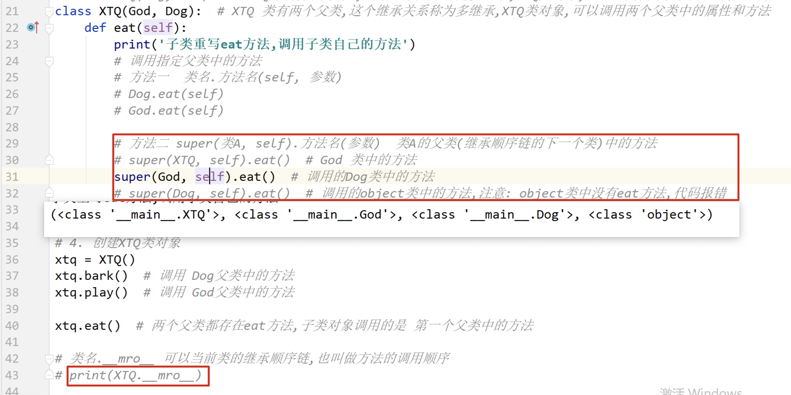
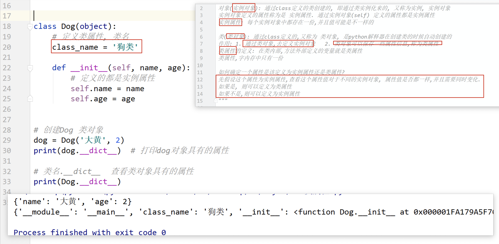
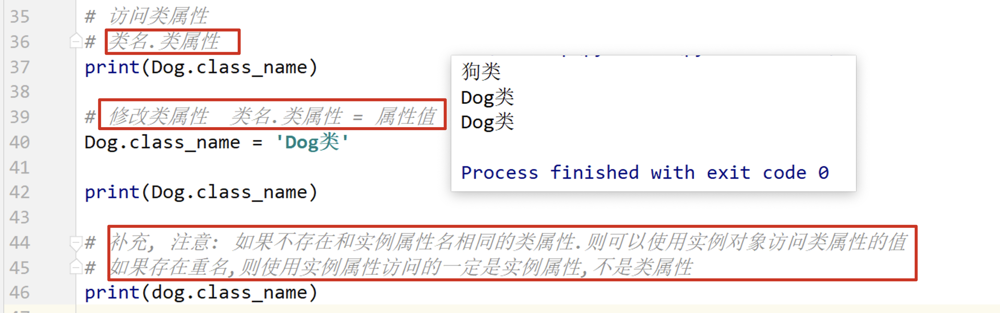

## day09 课堂笔记

## 0.复习和反馈


## 1. 继承的基本语法[掌握]

```python
继承: 描述的类与类之间所属关系.
基本语法:
class 类B(类A):
    pass

称为类 B 继承类 A
特点: B类的对象可以使用 A类的属性和方法
优点: 代码复用.重复相同的代码不用多次书写.
名词: 
    类A: 父类 		基类
    类B: 子类		派生类
```


## 2. 单继承和多层继承[理解]



## 3. 子类重写父类的同名方法[掌握]

```python
重写: 子类定义和父类名字相同的方法.
为什么重写: 父类中的方法,不能满足子类对象的需求,所以要重写.
重写之后的特点: 子类对象调用子类自己的方法,不再调用的方法,父类对象调用父类自己的方法.
```


## 4. 子类调用父类的同名方法[掌握]


## 5. 继承中的 init [掌握]


## 6. 多继承[理解]

如果一个类有两个及以上的父类,就把这种继承关系称为多继承.






## 7. 私有权限[理解]

```bash
访问权限控制: 在什么地方可以使用和操作.
私有权限: 
	定义: 在方法和属性前加上两个下划线, 就变为私有.
	1. 不能在类外部通过对象直接访问和使用, 只能在类内部访问和使用
	2. 不能被子类继承,
公有: 不是私有的,就是公有的.
```


## 8. 类属性[理解]





## 9. 类方法


## 10. 静态方法[掌握]


## 11. 多态[理解]


```python
鸭子类型 
```

