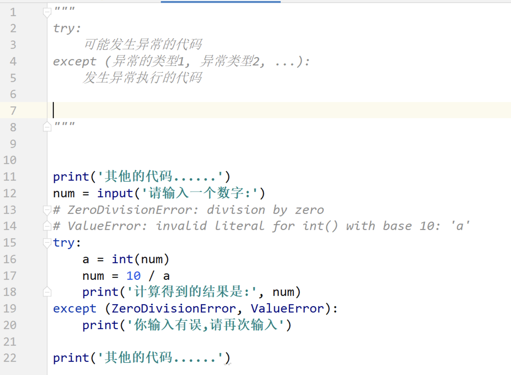
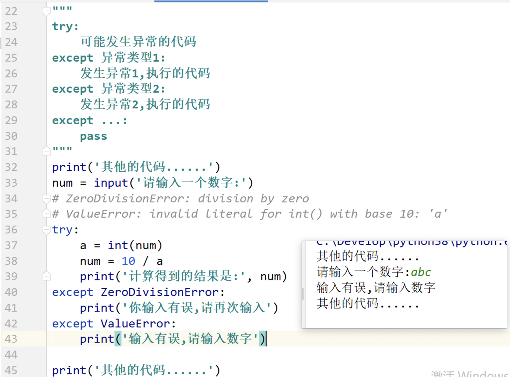
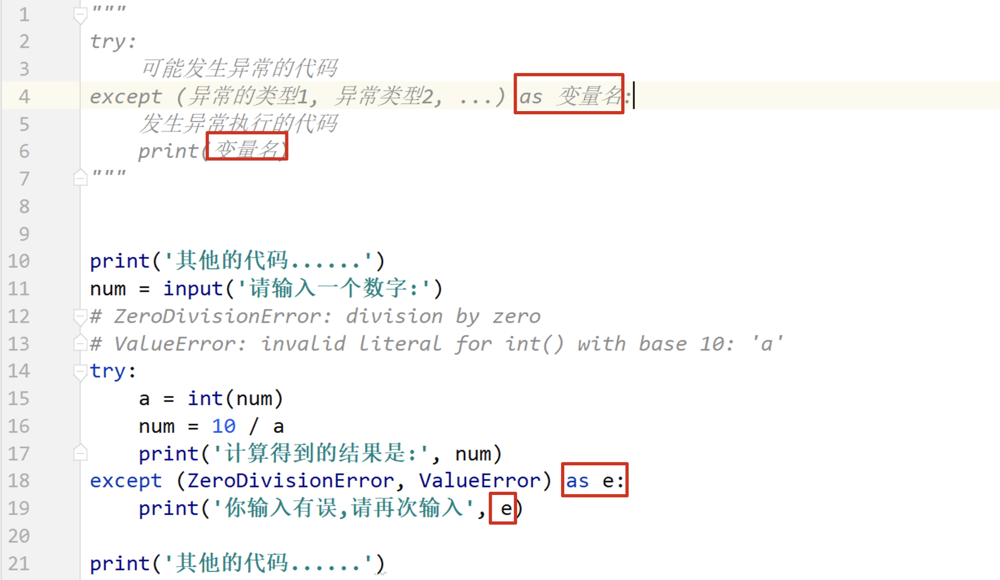
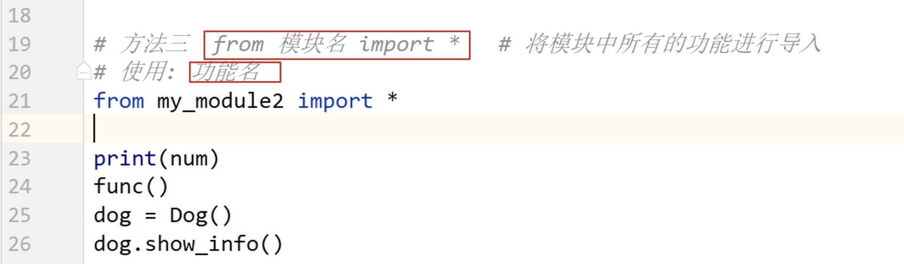
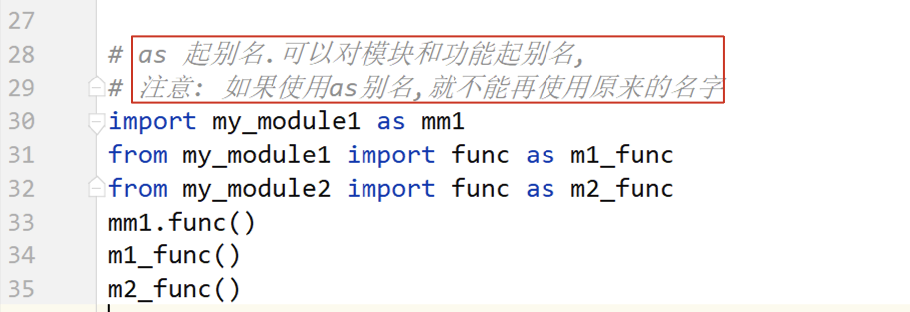
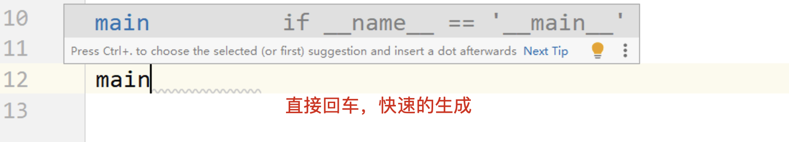
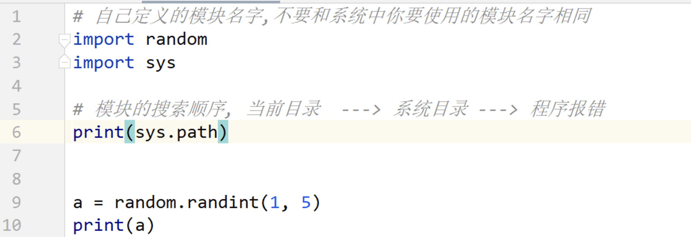

## day03 课堂笔记
[toc]

## 0. 复习和反馈

```python 
实例属性：
	类外部： 实例对象.属性名 = 属性值
    类内部： self.属性 = 属性值 （__init__）

类属性：
	类内部，方法外部直接定义的变量，就是类属性
    
实例方法：
	直接定义的方法
    def 方法名(self):
        # 方法使用了实例属性
        self.属性
        pass 
类方法：
	@classmethod 
    def 方法名(cls):
        类名.类属性
        cls.类属性
        pass
静态方法：
	@staticmethod 
    def 方法名():
        pass
```


## 1. 异常的概念[了解]

```bash
异常的组成:
`异常类型`: `异常具体的描述信息`
```


## 2. 捕获单个异常[掌握]


## 3. 捕获多个异常[掌握]





## 4. 打印异常信息[掌握]



## 5. 捕获所有的异常[掌握]

```python
try:
    可能发生异常的代码
except:   # 缺点, 不能获取异常的描述信息
    发生异常执行的代码
    
    
==============
try:
    可能发生异常的代码
except Exception as e:
    发生异常执行的代码
    print(e)
    pass

# Exception 是常见异常类的父类,
ZeroDivisionError --> ArithmeticError --> Exception --> BaseException  ---> object
ValueError --> Exception --> BaseException  ---> object
```


## 6. 异常的完整结构[掌握]

```python
try:
    可能发生异常的代码
except Exception as e:
    发生异常执行的代码
    print(e)
else:
    代码没有发生异常,会执行
finally:
    不管有没有发生异常,都会执行
```


## 7. 异常的传递[理解]

```python
是 python 异常处理的底层机制,是原理层面上的,不需要我们自己写代码实现,是 python 已经实现好的.

异常传递: 当一行代码发生异常之后,会向外层将这个异常进行传递,指导被捕获或者程序报错为止.
1. try 嵌套
2. 函数嵌套
```


## 8. 抛出自定义异常[理解]

```python 
程序代码为什么会报错?
因为不符合语法, 因为 python 的作者在代码中使用了 if 判断,如果除数为 0 ,就会在代码中抛出异常错误,
抛出异常:
    raise 异常对象  # 当程序代码遇到 raise 的时候,程序就报错了
    
异常对象 = 异常类(参数)  

抛出自定义异常:
    1. 自定义异常类,继承 Exception 或者 BaseException 
    2. 选择书写,定义 __init__方法,定义__str__ 方法
    3. 在合适的时机抛出异常对象即可
```


## 模块

```python 
import random
random.randint(a, b)  产生[a,b] 之间的随机整数, 包含 b的
import os
 
python 就是一个 python 代码文件,是别人已经写好的代码文件,文件中的函数类以及变量,我们都可以使用.

使用模块的好处:  直接使用别人已经实现好的功能,
```

### 模块的制作

```python
模块就是一个 python 文件
制作一个模块,其实就是定义一个 python 代码文件
注意点: 模块的名字要遵循标识符的规则(由字母,数字和下划线组成,不能以数字开头)
    
模块中可以定义变量,定义函数,定义类
```

### 模块的导入

```python 
想要使用模块中的内容,必须先导入模块 
注意点: 如果导入的是自己书写的模块,使用的模块和代码文件需要在一个目录中
```






### 模块中的变量 `__all__`


### 模块中的变量 `__name__`




### 模块的注意点



## 包

```python
包: 功能相近或者相似的模块放在一个目录中,并在目录中定义一个 __init__.py 文件,这个目录就是包
```


## 学生管理系统-面向对象版

```python
面向对象: 编程思想. 偷懒

对象 = 管理系统类()
对象.start() 
========
管理系统类
类名: StudentManagerSystem
属性: 
    所有学生信息
    学生列表 = []
    学生字典 = {'学号': 一个学生对象, }
方法: 增删改查 显示菜单信息, 

学生: 字典
类名: Student
属性:
    姓名 name
    年龄 age
    性别 gender
    学号 stu_id
方法: 
    init
    str
```

### 面向对象开发的一般方式

```python
1. 一个类作为一个 python 文件 
2. 定义一个 main.py 作为程序代码的启动文件

=====
代码文件的组成:
    student.py   # 定义 Student 类
    student_manager_system.py  # 定义管理系统类
    main.py  # 作为程序的启动代码
```

### 搭建框架代码

### 实现添加学生的功能

```python 
1. 使用 input 获取学生的信息
2. 使用学生信息,创建学生对象
3. 将学生对象添加的字典中
```


### 删除/修改/查询 学生

```python
1. 使用 input 输入学生学号
2. 判断学生信息是否存在
3. 存在进行操作
```

### 保存

```python 
{'11': 对象, '22': 对象}
{'11': 0x100, '22': 0x200}
str({'11': 0x100, '22': 0x200})

把具体的学生信息保存到文件中
11,aa,18,m
22,bb,16,f

for x in {}.values():
    pass
```


### 读取


```python 

读取文件,一行内容就是一个学生信息
readlines 读取所有行
['11,aa,18,m\n', '22,bb,16,f\n']
将列表中的每一项数据转换为对象
Student(id, name, age, gender)
'11,aa,18,m\n'.strip()  ==> '11,aa,18,m'.split() ===> [11,aa,18,m]
```

